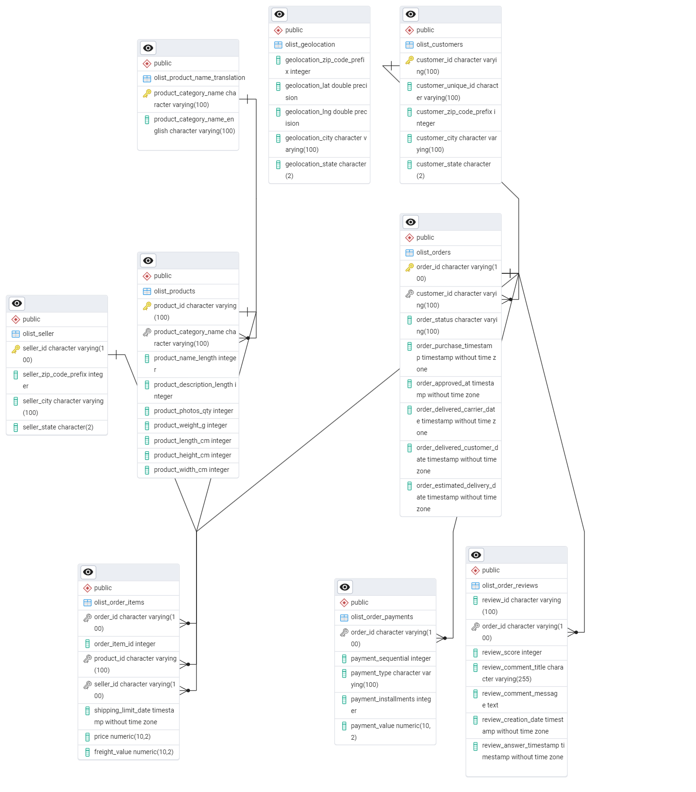

# OList E-Commerce Data Analysis SQL Project

**Overview**
Welcome to the Olist E-commerce Dataset Analysis Project. This project explores the rich dataset provided by Olist, a Brazilian e-commerce platform, focusing on customer orders, product information, reviews, seller information, geolocation and sales metrics. Through this analysis, I aim to uncover valuable insights into customer behavior, product performance, and overall business trends within the e-commerce domain.

**Objective 1 - Database Design and Importing Data**
The first objective is to import the data to a relational database in Postgresql. There are 9 tables in this dataset by Olist which have a relation with each other. The following tasks will be performed :

* Creating all tables in certain order so that the relationship between the tables can be established
* Choosing the adequate datatypes for the data set values
* Creating important primary keys and foreign keys for relationship among tables
* Importing data into tables with particular order to maintain relation
* Create Entity Relationship Diagram (ERD) to show the table relations.

### Data Schema
A data schema is provided by Olist. 

### Table Olist_geolocation
This table cannot have zip_code_prefix as the primary key as there are duplicate values becasue for a particular zip code there can be multiple corrdinates where the order could have been delivered. Due to the same reason this table cannot connect to other tables until this issue is resolved.

### Table Olist_Customers
The primary key for this table is Customer_ID and it has 99441 values

### Table Olist_sellers
This table has seller_id as primary key and has 3095 values

### Table Olist_Order
This table has order_id as primary key and customer_id as foreign key

### Table Olist_Order_reviews
This table has order_id as foreign key

### Table Olist_Order_payments
This table has order_id as foreign key

### Table Olist_product_name_translation
This table has product_category_name as the primary key which has 73 values

### Table Olist_products
This table has product_id as primary key with values 32951 and product_category_name as foreign key

### Table Olist_order_items
This is the last table to be created as it has relations with three tables with order_id, seller_id and Product_id as its foreign keys

### Entity Relationship Diagram
This diagram illustrates all the relations between the different tables that I created. 

## Exploratory Data Analysis
The second objective is to do Exploratory Data Analysis and find out the answers to the questions which will help gain insights. There are three different analysis based on the data to better understand overall e-commerce business.

### Customer and Seller Analysis
[SQL File](/EDA_Olist_SQL/Customer&seller_analysis.sql)

### Delivery and Review Analysis
[SQL File](/EDA_Olist_SQL/Delivery&Review_analysis.sql)

### Sales and Revenue Analysis
[SQL File](/EDA_Olist_SQL/Sales&Revenue_analysis.sql)

## Tools Used
* SQL: The backbone of the project used for importing data and doing exploratory data analysis.
* Postgresql: The database management system ideal for handling the Olist dataset.
* Visual Studio Code: VS code is my go-to Integrated development Environment (IDE) to manage database and executing queries.
* Git and GitHub: Essential for project tracking and sharing SQL queries and analysis.

## SQL Files
[Setup Folder](/SQL_Olist_Setup/)
[EDA_Olist_SQL](/EDA_Olist_SQL/)
[Delivery&Review_analysis.sql](/EDA_Olist_SQL/Delivery&Review_analysis.sql)
[Customer&seller_analysis.sql](/EDA_Olist_SQL/Customer&seller_analysis.sql)
[Sales&Revenue_analysis.sql](/EDA_Olist_SQL/Sales&Revenue_analysis.sql)
